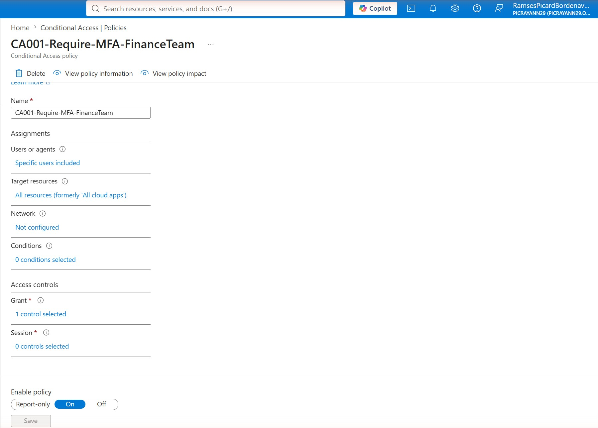
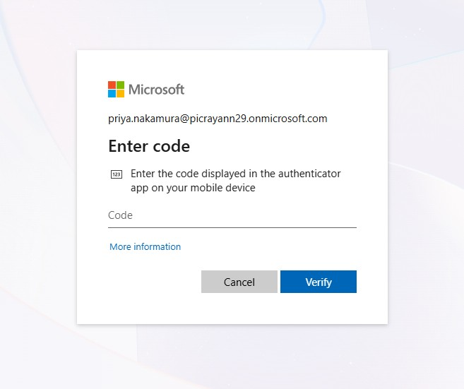
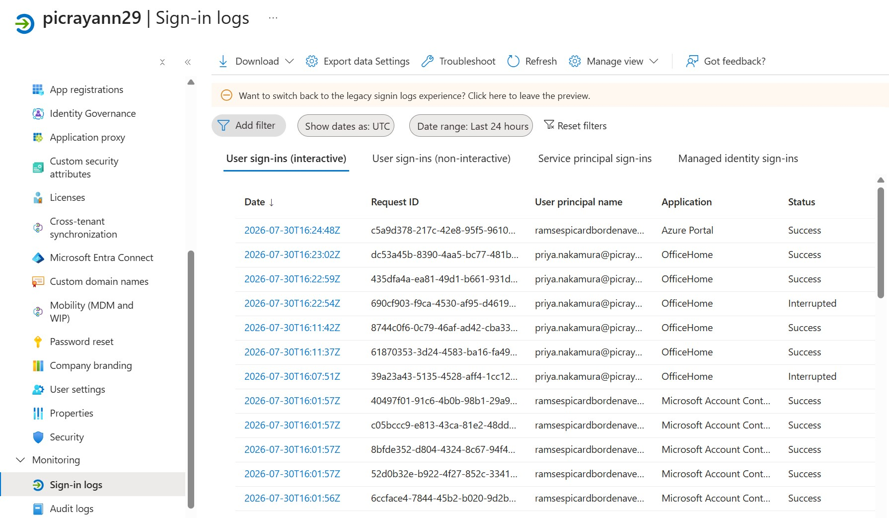

# Priority 1 — Create a Conditional Access Policy (Require MFA for a Group)

**Project:** Zero Trust Access Governance Lab
**Domain:** Implement access management for Conditional Access
**Status:** Completed and enabled in a live Microsoft Entra tenant

## Objective

Enforce multifactor authentication (MFA) for members of a finance security group by creating and enabling a Conditional Access policy in Microsoft Entra ID. The policy was first validated in Report-only mode, then switched to On, and finally confirmed by an end-user MFA challenge and a corresponding sign-in log entry.

## Environment

| Item | Value |
| --- | --- |
| Tenant | picrayann29.onmicrosoft.com |
| Policy name | CA001-Require-MFA-FinanceTeam |
| Target group | Finance-Team (assigned membership) |
| Test user | Priya Nakamura (priya.nakamura@picrayann29.onmicrosoft.com) |
| Grant control | Require multifactor authentication |
| Target resources | All resources (formerly 'All cloud apps') |
| Policy state | On |

## Steps Performed

1. In the Microsoft Entra admin center, navigated to Protection > Conditional Access > Policies and created a new policy named `CA001-Require-MFA-FinanceTeam`.
2. Under Assignments > Users, scoped the policy to specific users by selecting the **Finance-Team** security group (test member: Priya Nakamura).
3. Set Target resources to **All resources**, left Network and Conditions unconfigured for this baseline policy.
4. Under Access controls > Grant, selected **Require multifactor authentication** (1 control selected).
5. Set Enable policy to **Report-only** first and reviewed the What-If / sign-in impact before enforcing.
6. After validating no unintended lockout, switched Enable policy to **On** and saved.
7. Signed in as Priya Nakamura to trigger and confirm the MFA challenge, then reviewed the Sign-in logs for policy evaluation.

## Screenshots

### 1. Conditional Access policy configuration

### 2. MFA challenge presented to the test user

### 3. Sign-in logs confirming policy evaluation

## Validation

- The policy appears in Conditional Access > Policies as a user-created policy with **State: On**.
- Policy details confirm: 1 group targeted, 0 excluded identities, all resources included, and the access requirement **Require multifactor authentication**.
- Signing in as Priya Nakamura produced the expected authenticator **Enter code** challenge.
- The Sign-in logs show interactive sign-ins for `priya.nakamura` (OfficeHome), including successful sign-ins and interrupted attempts consistent with an MFA challenge being enforced.

## Key Takeaways

- Report-only mode is a safe first step: it lets you observe policy impact in the sign-in logs before enforcement, reducing the risk of locking users out.
- Scoping to a security group (rather than individual users) makes the policy scalable — new finance hires inherit MFA enforcement simply by group membership.
- The sign-in logs are the primary evidence that a Conditional Access policy actually evaluated during authentication, which is essential for both troubleshooting and audit.

---

*Configuration performed in a personal, non-production tenant as part of SC-300 exam preparation.*

