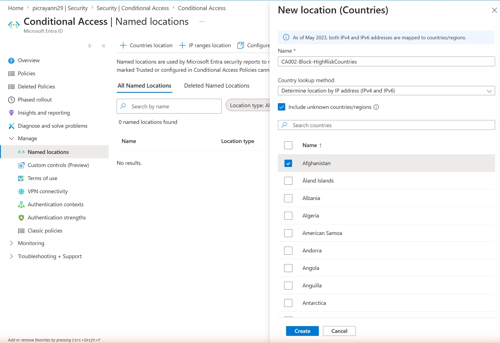
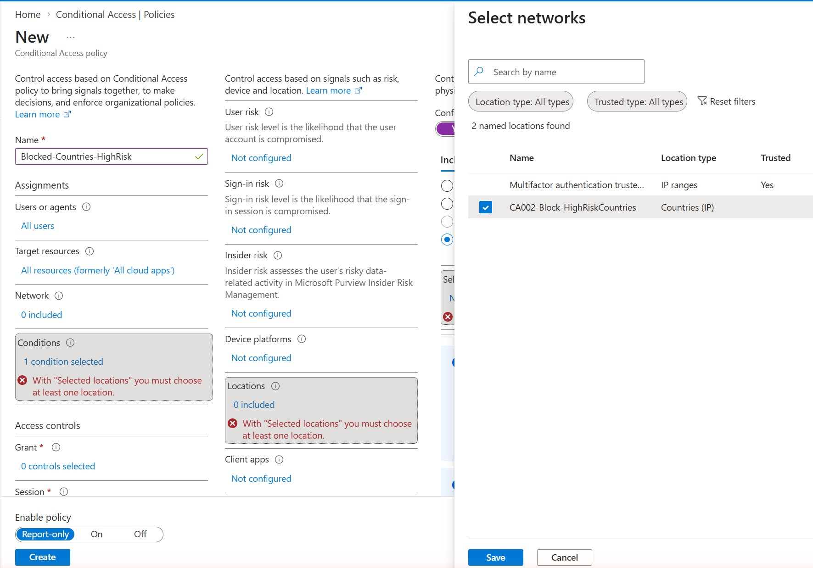
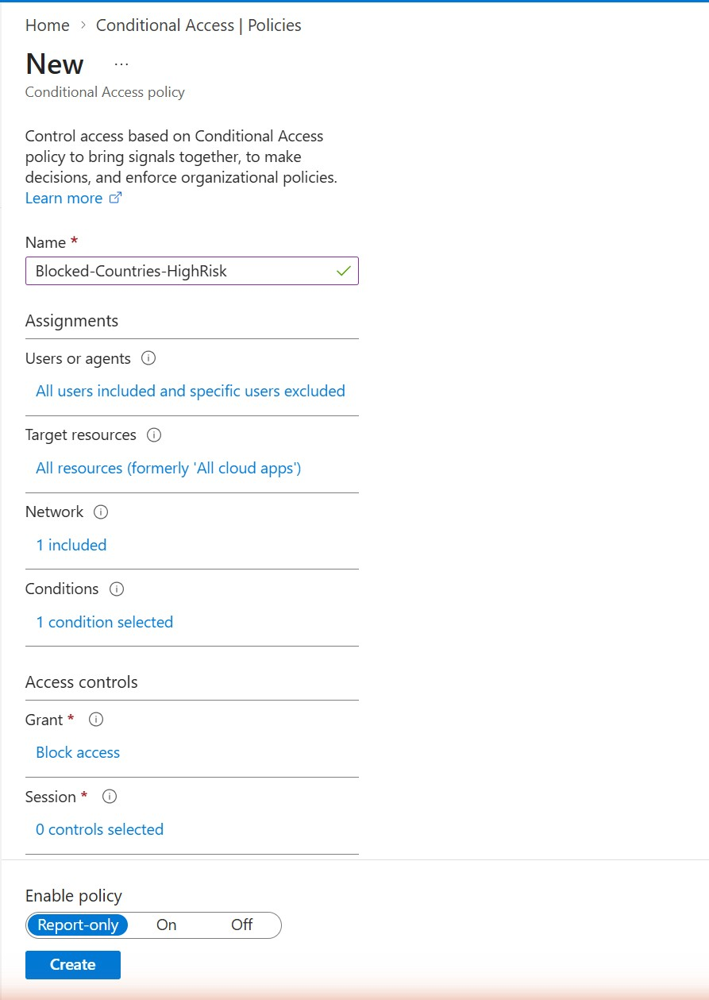

# Priority 1 — Create a Conditional Access Policy with Named Locations (Block by Country)

**Project:** Zero Trust Access Governance Lab
**Domain:** Implement access management for Conditional Access (named locations / location-based conditions)
**Status:** Created and running in Report-only mode in a live Microsoft Entra tenant

## Objective

Reduce attack surface by blocking sign-ins that originate from high-risk countries/regions. This is done in two parts: first defining a **named location** that lists the countries to treat as high-risk (and treats unknown/unmapped locations as in-scope), then building a Conditional Access policy that **blocks access** when a sign-in matches that location. The policy targets all users while excluding the break-glass/admin account to avoid lockout.

## Environment

| Item | Value |
| --- | --- |
| Tenant | picrayann29.onmicrosoft.com |
| Named location | CA002-Block-HighRiskCountries (type: Countries / IP) |
| Country lookup method | Determine location by IP address (IPv4 and IPv6) |
| Include unknown countries/regions | Enabled |
| Policy name | Blocked-Countries-HighRisk |
| Assignments | All users included, admin account excluded |
| Target resources | All resources (formerly 'All cloud apps') |
| Condition | Locations = the named location (1 condition selected) |
| Grant control | Block access |
| Policy state | Report-only |

## Steps Performed

1. In the Microsoft Entra admin center, went to Protection > Conditional Access > Named locations and created a **Countries location** named `CA002-Block-HighRiskCountries`.
2. Left the country lookup method as **Determine location by IP address (IPv4 and IPv6)** and enabled **Include unknown countries/regions** so sign-ins from IPs that can't be geo-resolved are also caught.
3. Selected the high-risk countries to include in the named location and created it.
4. Created a new Conditional Access policy named `Blocked-Countries-HighRisk`.
5. Under Assignments > Users, selected **All users** and added the admin account under **Exclude** to prevent an accidental lockout.
6. Set Target resources to **All resources**.
7. Under Conditions > Locations, chose **Selected locations** and included the `CA002-Block-HighRiskCountries` named location (1 condition selected).
8. Under Access controls > Grant, selected **Block access**.
9. Set Enable policy to **Report-only** and created the policy, then validated impact by temporarily including my own location and confirming the block would apply before considering enforcement.

## Screenshots

### 1. Named location — countries with "Include unknown countries/regions" enabled

### 2. CA policy — including the named location as the location condition

### 3. CA policy summary — Block access, admin excluded, Report-only

## Validation

- The named location `CA002-Block-HighRiskCountries` appears under Named locations (type Countries/IP) and is linked to the `Blocked-Countries-HighRisk` policy.
- The policy appears in Conditional Access > Policies as a user-created policy with **State: Report-only**.
- Policy configuration confirms: All users (admin excluded), all resources, a location condition set to the named location, and the access control **Block access**.
- Impact was validated in Report-only mode by temporarily including my own location and confirming the policy would block the sign-in.

## Key Takeaways

- Enabling **Include unknown countries/regions** is a deliberate hardening choice: sign-ins from IP addresses that can't be geo-resolved are often anonymizing proxies or VPNs, so treating them as in-scope closes a common bypass.
- Always **exclude a break-glass/admin account** from a blocking geo policy — otherwise a misconfiguration or an admin travelling can lock everyone out, including the person who could fix it.
- **Report-only mode** is the safe way to introduce a Block policy: it records what *would* have happened in the sign-in logs so you can confirm the impact before enforcing.

---

*Configuration performed in a personal, non-production tenant as part of SC-300 exam preparation.*
