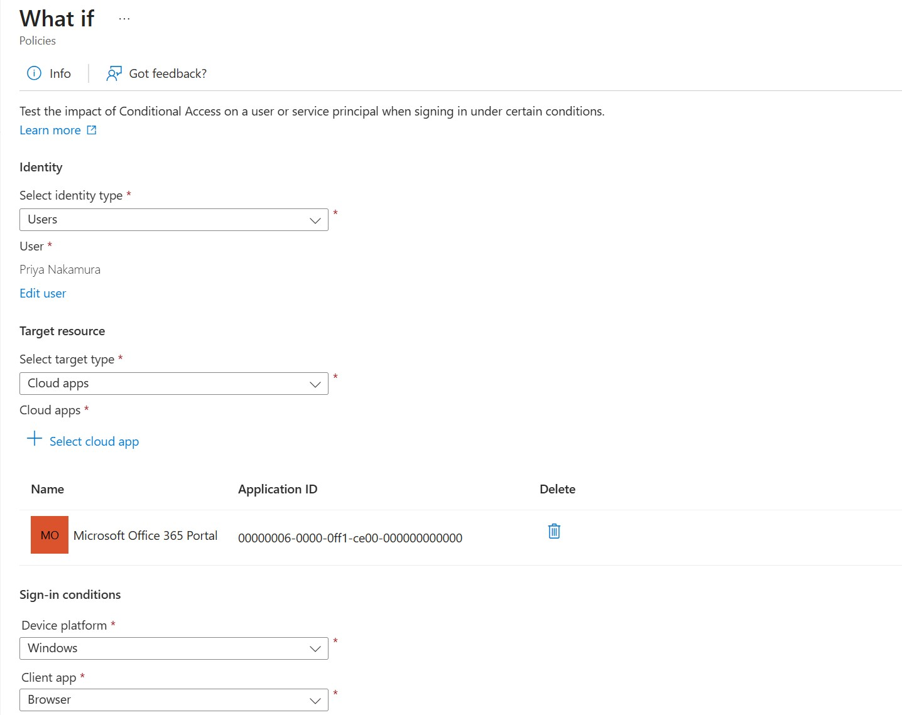
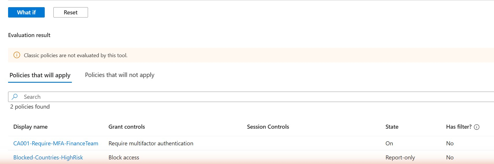
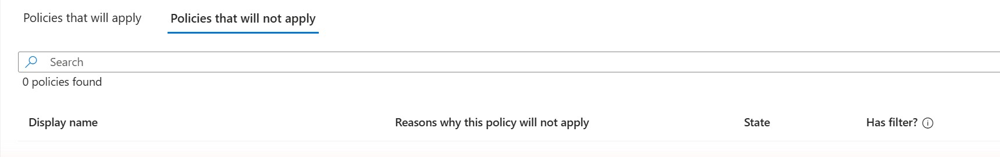

# Priority 1 — Validate a Conditional Access Policy with the What-If Tool

**Project:** Zero Trust Access Governance Lab
**Domain:** Implement access management for Conditional Access (policy testing / What-If simulation)
**Status:** Validated against live policies in a Microsoft Entra tenant

## Objective

Before relying on a Conditional Access policy in production, prove it actually behaves as designed for a specific user and sign-in scenario. The Conditional Access **What-If** tool simulates a sign-in for a chosen identity, target app, and set of conditions, then reports which policies **would apply** and which **would not apply** — without the user ever having to sign in. Here it was used to confirm that `CA001-Require-MFA-FinanceTeam` correctly targets a member of the Finance team (Priya Nakamura) and enforces multifactor authentication.

## Environment

| Item | Value |
| --- | --- |
| Tenant | picrayann29.onmicrosoft.com |
| Tool | Protection > Conditional Access > Policies > What If |
| Simulated identity | Priya Nakamura (member of Finance-Team) |
| Target resource | Microsoft Office 365 Portal (app ID 00000006-0000-0ff1-ce00-000000000000) |
| Device platform | Windows |
| Client app | Browser |
| Policy under test | CA001-Require-MFA-FinanceTeam (State: On) |
| Result — will apply | CA001-Require-MFA-FinanceTeam (Require MFA) + Blocked-Countries-HighRisk (Report-only) |
| Result — will not apply | 0 policies |

## Steps Performed

1. In the Microsoft Entra admin center, went to **Protection > Conditional Access > Policies** and opened the **What If** tool.
2. Set **Identity type** to *Users* and selected **Priya Nakamura**, a member of the Finance-Team group that `CA001-Require-MFA-FinanceTeam` targets.
3. Set **Target resource** to *Cloud apps* and selected **Microsoft Office 365 Portal**.
4. Set the sign-in conditions: **Device platform = Windows** and **Client app = Browser**.
5. Ran the simulation with **What If** and reviewed the **Evaluation result**.
6. On the **Policies that will apply** tab, confirmed `CA001-Require-MFA-FinanceTeam` (grant control *Require multifactor authentication*, State *On*) is listed — proving the MFA requirement fires for a Finance-Team member.
7. On the **Policies that will not apply** tab, confirmed **0 policies** — nothing was incorrectly excluded for this user/scenario.

## Screenshots

### 1. What-If simulation setup — Priya Nakamura / Office 365 Portal / Windows / Browser

### 2. Policies that will apply — CA001 (Require MFA) fires for a Finance-Team member

### 3. Policies that will not apply — 0 policies

## Validation

- For Priya Nakamura signing in to the Office 365 Portal, the What-If tool lists `CA001-Require-MFA-FinanceTeam` under **Policies that will apply**, confirming the group-scoped MFA requirement is correctly targeted and enforced.
- `Blocked-Countries-HighRisk` also appears as applying, correctly reported with its **Report-only** state (so it evaluates but does not block).
- The **Policies that will not apply** tab returns **0 policies**, meaning no policy was silently skipped for this scenario.
- The simulation reflects the live policy states shown in the tool: CA001 = *On*, Blocked-Countries-HighRisk = *Report-only*.

## Key Takeaways

- The What-If tool lets you validate Conditional Access **before** a real user is affected — essential for catching scoping mistakes (wrong group, wrong app, unintended exclusions) without waiting for sign-in logs.
- Seeing a policy under **Policies that will apply** with the expected grant control is direct proof that group targeting works as intended; an empty **will not apply** list confirms nothing was mis-scoped out.
- Report-only policies still surface in the results (labelled *Report-only*), which makes What-If a good way to preview a policy's reach before flipping it to *On*.
- Classic policies are not evaluated by this tool — a limitation worth remembering when auditing older tenants.

---
*Configuration performed in a personal, non-production tenant as part of SC-300 exam preparation.*
