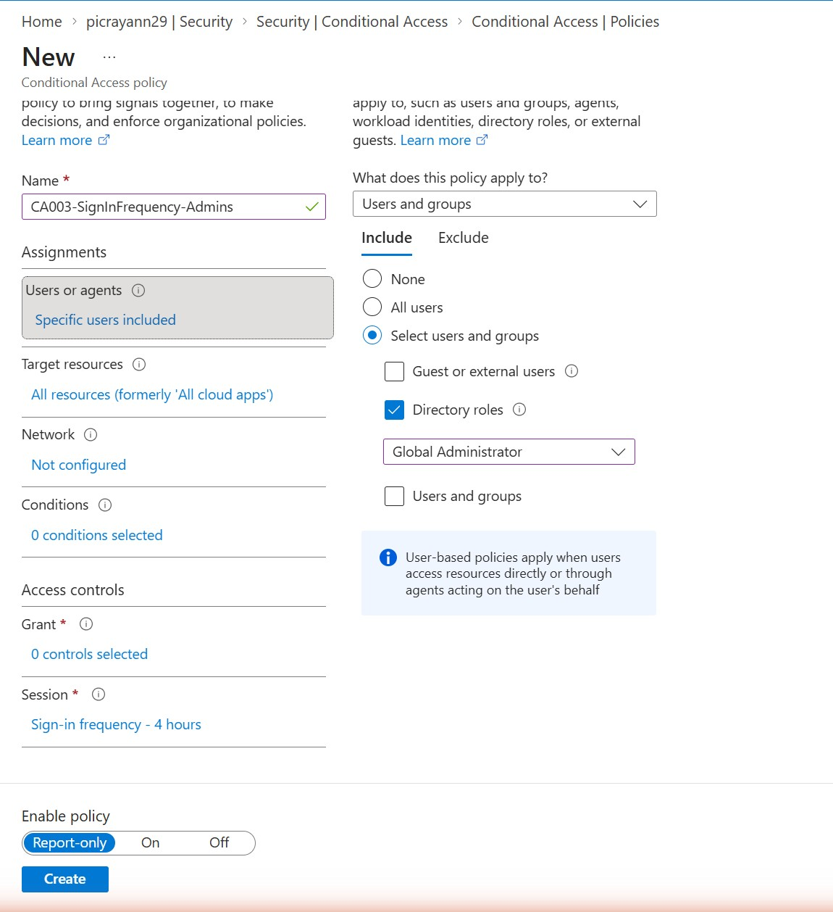
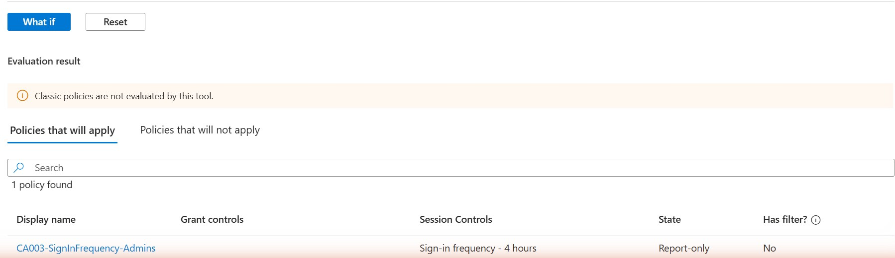

# Priority 1 — Conditional Access Session Controls (Sign-in Frequency)

**Project:** Zero Trust Access Governance Lab
**Domain:** Implement access management for Conditional Access (session controls / sign-in frequency)
**Status:** Created and running in Report-only mode in a live Microsoft Entra tenant

## Objective

Reduce the risk window on privileged sessions by forcing administrators to reauthenticate periodically. By default, refresh tokens can keep a session alive for a long time, so a token stolen from a signed-in admin could grant extended access. A Conditional Access **session control** that sets a **sign-in frequency** requires the user to reauthenticate on a fixed interval — here, every 4 hours for anyone holding the Global Administrator role. The policy was validated with the What-If tool before being considered for enforcement.

## Environment

| Item | Value |
| --- | --- |
| Tenant | picrayann29.onmicrosoft.com |
| Policy name | CA003-SignInFrequency-Admins |
| Assignment (Users) | Directory roles = Global Administrator |
| Target resources | All resources (formerly 'All cloud apps') |
| Grant control | 0 controls (session-only policy) |
| Session control | Sign-in frequency = Periodic reauthentication, every 4 hours |
| Policy state | Report-only |

## Steps Performed

1. In the Microsoft Entra admin center, went to **Protection > Conditional Access > Policies** and created a new policy named **CA003-SignInFrequency-Admins**.
2. Under **Assignments > Users or agents**, chose **Select users and groups > Directory roles** and selected the **Global Administrator** role, so the policy targets accounts holding that privileged role rather than named individuals.
3. Left **Target resources** as **All resources**.
4. Left **Grant** with no controls — this is a session-only policy, so access isn't blocked or gated, only the session lifetime is shortened.
5. Under **Access controls > Session**, enabled **Sign-in frequency** and set **Periodic reauthentication** to **4 hours**.
6. Set **Enable policy** to **Report-only** and created the policy.
7. Validated the policy with the **What-If** tool (see Milestone 3 write-up for the tool itself): simulated a Global Administrator sign-in and confirmed the policy is returned under **Policies that will apply** with the session control **Sign-in frequency - 4 hours**.

## Screenshots

### 1. Policy configuration — Global Administrator role, Sign-in frequency 4 hours

### 2. What-If result — session control enforced for the targeted admin

## Validation

- The policy **CA003-SignInFrequency-Admins** appears in **Conditional Access > Policies** as a user-created policy with **State: Report-only**.
- The **What-If** tool returns the policy under **Policies that will apply** for a Global Administrator sign-in, with **Session Controls = Sign-in frequency - 4 hours**, confirming the session control is correctly scoped and would be enforced.
- **Note on evidence:** the screenshots demonstrate that the session control is *configured and evaluated as applying* to the targeted role. They do **not** capture a live, timed reauthentication prompt firing after 4 hours — a real reauth event wasn't practical to observe within a single session, so it is intentionally not claimed here.

## Key Takeaways

- Sign-in frequency is a **session control**, not a grant control: it doesn't block access, it shortens how long a session stays valid before reauthentication is required. That makes it a good defence against stolen/replayed tokens.
- Scoping to the **Global Administrator directory role** (rather than to individual users) means the control automatically follows the privilege: anyone who holds or is later assigned that role is covered, and anyone who loses it drops out of scope.
- Shorter reauthentication intervals are most justified for **privileged accounts**, where the blast radius of a hijacked session is highest — a broad 4-hour frequency on every user would create excessive prompt fatigue.
- Validating with What-If in **Report-only** first confirms the control applies to the right identities before it starts interrupting real admin sessions.

---
*Configuration performed in a personal, non-production tenant as part of SC-300 exam preparation.*
