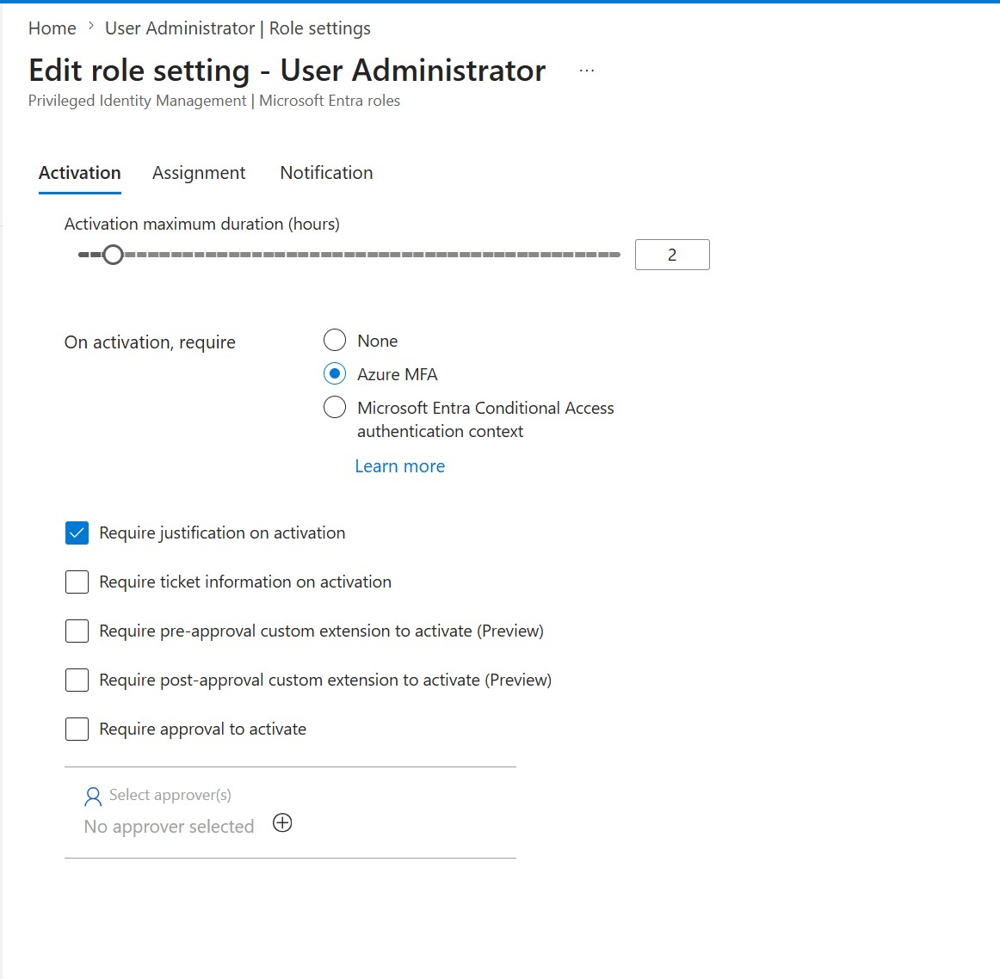

# Priority 1 — Privileged Identity Management (PIM) for a Directory Role

**Project:** Zero Trust Access Governance Lab
**Domain:** Implement identity governance (Privileged Identity Management — just-in-time privileged access)
**Status:** Configured in a live Microsoft Entra tenant

## Objective

Remove standing (always-on) administrative access and replace it with **just-in-time (JIT)** access using **Privileged Identity Management (PIM)**. Instead of a user permanently holding an admin role, they are made *eligible* for it and must **activate** the role when they actually need it — for a limited time, and only after passing extra checks. This shrinks the attack surface: a compromised account that isn't currently activated holds no admin rights, and every activation is time-bound and logged. Here, PIM was configured for the **User Administrator** directory role.

## Environment

| Item | Value |
| --- | --- |
| Tenant | picrayann29.onmicrosoft.com |
| Feature | Privileged Identity Management > Microsoft Entra roles |
| Role configured | User Administrator |
| Activation maximum duration | 2 hours |
| On activation, require | Azure MFA |
| Require justification on activation | Yes |
| Require ticket information on activation | No |
| Require approval to activate | No (no approvers configured) |

## Steps Performed

1. In the Microsoft Entra admin center, went to **Identity Governance > Privileged Identity Management > Microsoft Entra roles**.
2. Opened **Manage > Roles** and selected the **User Administrator** role.
3. Opened **Role settings** and edited the **Activation** settings.
4. Set **Activation maximum duration** to **2 hours**, so an activated session automatically expires rather than lingering.
5. Set **On activation, require** to **Azure MFA**, forcing a strong reauthentication at the moment privilege is claimed.
6. Enabled **Require justification on activation**, so every activation records a business reason for auditing.
7. Left approval/ticketing off for this lab, and saved the settings.

## Screenshots

### 1. PIM role settings — User Administrator activation requirements

## Validation

- In **PIM > Microsoft Entra roles > Roles > User Administrator > Role settings**, the live **Activation** settings show: **Activation maximum duration = 2 hour(s)**, **On activation, require = Azure MFA**, and **Require justification on activation = Yes**.
- **Require ticket information** and **Require approval to activate** are **No**, and **Approvers = None**, matching the lab configuration.
- The settings are visible on the role's read-only settings summary, confirming they persisted after saving.

## Key Takeaways

- **Standing admin access is an attack surface.** A permanently assigned Global/User Administrator is a high-value target 24/7; with PIM the role is dormant until activated, so a stolen but un-activated account can't wield admin rights.
- **Time-boxing activations** (2-hour max here) means privilege is automatically relinquished, reducing the window in which a hijacked session could do damage.
- **MFA on activation** ties the moment of privilege escalation to a fresh strong-auth challenge — even a valid session token isn't enough to silently activate.
- **Justification on activation** creates an audit trail of *why* admin access was used, which is invaluable for reviews and incident investigations.
- Eligible-vs-active is the core PIM concept: users are made *eligible* (permission to activate) rather than *active* (holding the role), and activation is the auditable, policy-gated event.

---
*Configuration performed in a personal, non-production tenant as part of SC-300 exam preparation.*
