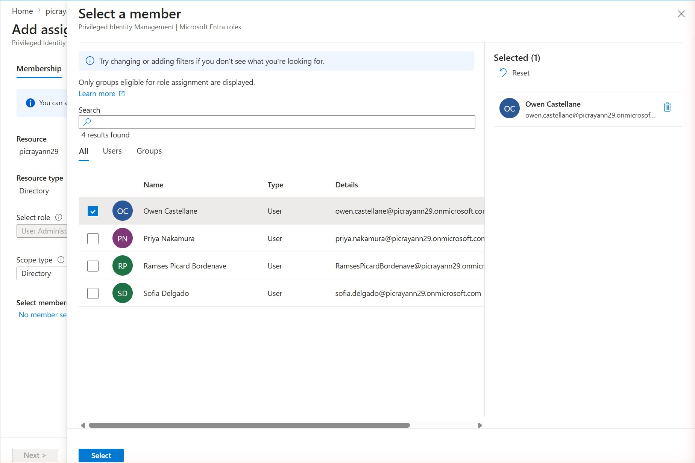
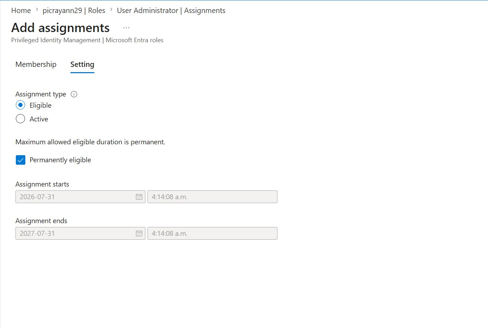
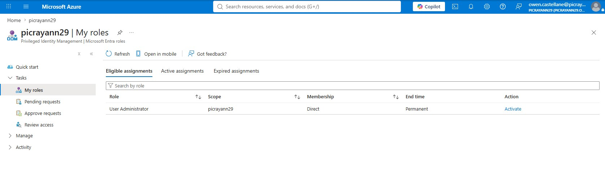
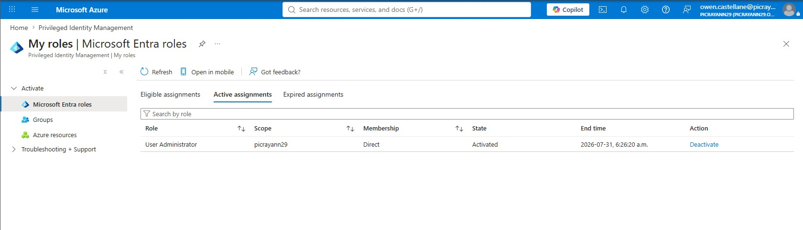

# Priority 1 — PIM Eligibility Assignment and Activation Test

**Project:** Zero Trust Access Governance Lab
**Domain:** Implement identity governance (Privileged Identity Management — just-in-time privileged access)
**Status:** Configured and tested in a live Microsoft Entra tenant

## Objective

Prove out the full **Privileged Identity Management (PIM)** lifecycle end-to-end. Milestone 5 configured the **settings** for the User Administrator role (2-hour max activation, MFA on activation, justification required). This milestone exercises those settings with a real user: making **Owen Castellane** *eligible* for the User Administrator role, then having Owen **activate** it to obtain time-bound admin access. Together, Milestone 5 (the "settings" half) and this milestone (the "usage" half) tell one complete PIM story. This demonstrates the difference between *eligible* (permission to activate) and *active* (currently holding the role), which is the heart of just-in-time privileged access.

## Environment

| Item | Value |
| --- | --- |
| Tenant | picrayann29.onmicrosoft.com |
| Feature | Privileged Identity Management > Microsoft Entra roles |
| Role | User Administrator |
| Eligible user | Owen Castellane (owen.castellane@picrayann29.onmicrosoft.com) |
| Assignment type | Eligible, Direct, scope picrayann29, permanently eligible |
| Activation gates (from Milestone 5) | Azure MFA + justification required, 2-hour max duration |

## Steps Performed

1. In the Microsoft Entra admin center, went to **Identity Governance > Privileged Identity Management > Microsoft Entra roles > Roles** and opened the **User Administrator** role.
2. Selected **Add assignments** and, on the **Membership** tab, chose **Owen Castellane** as the member.
3. On the **Setting** tab, set the **Assignment type** to **Eligible** (not Active) and left it **Permanently eligible**, so Owen must activate the role on demand rather than holding it permanently.
4. Confirmed the new eligible assignment appears for the role.
5. Signed in **as Owen**, opened **Privileged Identity Management > My roles > Microsoft Entra roles**, and saw the **User Administrator** role listed under **Eligible assignments** with an **Activate** action.
6. Chose **Activate**, satisfying the **Azure MFA** and **justification** gates configured in Milestone 5, which moved the role to **Active assignments** with the state **Activated** and a fixed expiry.

## Screenshots

### 1. Add assignment — selecting Owen as the member

### 2. Add assignment — Eligible (permanently eligible) setting

### 3. Owen's My roles — eligible, with Activate action

### 4. Owen's My roles — role now Activated (Active assignments)

## Validation

- From the admin side, the **Eligible assignments** tab for User Administrator lists **Owen Castellane** as an **eligible**, **Direct** assignment (scope picrayann29), confirming Owen can request the role but does not hold it by default.
- From Owen's own **My roles** view, the role first appears under **Eligible assignments** with an **Activate** link (screenshot 3), then under **Active assignments** with **State = Activated** and a bounded **End time** after activation (screenshot 4) — confirming the eligible → active transition actually occurred.
- The activation required passing the **Azure MFA** and **justification** gates from Milestone 5. (These prompts were completed during activation; the evidence captured here is Owen's My-roles Active view showing the successful **Activated** state rather than a screenshot of the MFA/justification dialog itself.)
- The active assignment is **time-bound** — once the window elapses it expires and Owen returns to eligible-only, leaving no standing admin access.

## Key Takeaways

- **Eligible vs. active is the core PIM concept.** Owen is *eligible* (allowed to request the role) rather than *active* (currently holding it). Between activations he has zero admin rights, so a compromise of his account grants nothing until he passes the activation gates.
- **Milestone 5 + Milestone 6 are two halves of one PIM story:** M5 defined the *policy* (who must MFA, provide justification, and for how long); M6 *exercised* that policy with a real assignment and a real activation.
- **Just-in-time beats standing access.** Rather than a permanent User Administrator, the role is dormant until needed and self-expiring, dramatically shrinking the window an attacker could abuse it.
- **Every activation is auditable and gated.** The MFA challenge ties escalation to a fresh strong-auth event and the justification records a business reason — both invaluable for access reviews and incident investigation.

---
*Configuration performed in a personal, non-production tenant as part of SC-300 exam preparation.*
