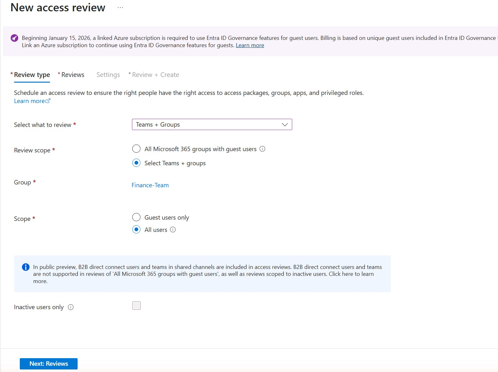
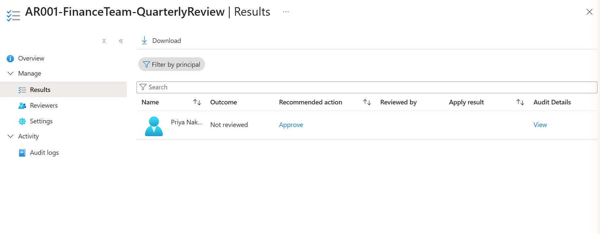
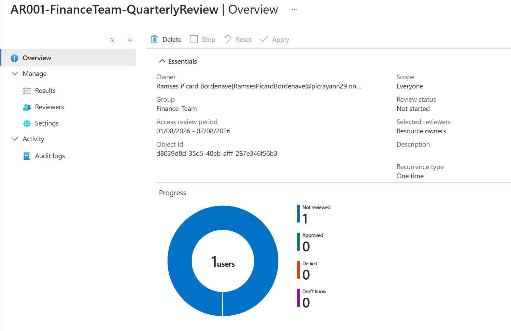

# Priority 1 — Access Review on a Group

**Project:** Zero Trust Access Governance Lab
**Domain:** Implement identity governance (Access Reviews — periodic entitlement re-certification)
**Status:** Configured in a live Microsoft Entra tenant; review in progress (decision not yet finalized)

## Objective

Use **Access Reviews** to periodically re-certify who should still have access to a resource, rather than assuming a group's membership stays correct forever. Unlike Conditional Access or PIM, which gate access at sign-in or activation time, an access review is a recurring (or one-time) governance checkpoint: a reviewer is asked "does this person still need this access?" and the answer can automatically be applied to the resource. Here, a one-time access review — **AR001-FinanceTeam-QuarterlyReview** — was created and scoped to the **Finance-Team** group.

## Environment

| Item | Value |
| --- | --- |
| Tenant | picrayann29.onmicrosoft.com |
| Feature | Identity Governance > Access Reviews |
| Review name | AR001-FinanceTeam-QuarterlyReview |
| Reviewed resource | Finance-Team group (Teams + Groups, Select Teams + groups, Scope = All users) |
| Recurrence | One time |
| Review period | 01/08/2026 – 02/08/2026 |
| Reviewers | Resource owners (group owners) |
| Require reason on approval | Enabled |
| Auto apply results to resource | Enabled |
| If reviewers don't respond | No change |

## Steps Performed

1. In the Microsoft Entra admin center, went to **Identity Governance > Access Reviews** and selected **New access review**.
2. On **Review type**, chose **Teams + Groups**, set **Review scope** to **Select Teams + groups**, and picked the **Finance-Team** group, with **Scope = All users**.
3. On **Settings**, set the reviewers to **Resource owners**, enabled **Require reason on approval**, and — on the **When completed** tab — set **Auto apply results to resource = Enable** with **If reviewers don't respond = No change**.
4. Created the review (**AR001-FinanceTeam-QuarterlyReview**), which surfaced one member of Finance-Team — **Priya Nakamura** — as the item to be reviewed.
5. Checked the review's **Results** and **Overview** panes to confirm the configuration took effect: recommended action, reviewer type, and the auto-apply settings all matched what was configured in step 3.

## Screenshots

### 1. New access review — review type configuration

### 2. Results grid — Priya Nakamura listed for review

### 3. Overview — review status and progress

## Validation

- The **Overview** pane confirms the review is scoped to **Finance-Team**, is a **one-time** review, and lists **Selected reviewers = Resource owners** — matching the configuration in step 3.
- The **Results** grid shows **Priya Nakamura** with a system **Recommended action of "Approve"** (Entra's suggestion based on her recent sign-in activity), which is a recommendation only, not a recorded decision.
- **Honest status check:** at the time these screenshots were captured, the **Overview** showed **Review status = Not started** and **Progress: 1 not reviewed, 0 approved, 0 denied, 0 don't know**, and the **Results** row showed **Outcome = Not reviewed** with empty **Reviewed by** and **Apply result** fields. In other words, the review has been fully configured and is live, but the actual reviewer decision on Priya Nakamura had **not yet been recorded** as of this write-up — it had not been approved, denied, or auto-applied. This is documented here plainly rather than claiming a completed approval that the evidence doesn't show.
- The **auto-apply** and **no-change fallback** settings were verified directly in **Settings > When completed**, confirming that once a decision (or the review's end date) is reached, the outcome will be written back to the group automatically without a manual "apply" step.

## Key Takeaways

- **Access reviews are periodic re-certification, not point-in-time enforcement.** Unlike Conditional Access (evaluated at every sign-in) or PIM (evaluated at every activation), an access review asks a human "should this access still exist?" on a schedule, closing the gap where permissions quietly become stale.
- **Auto-apply is what makes a review actually enforce something.** A review that only records answers but never applies them is just a survey; enabling **Auto apply results to resource** is what turns a decision (or a "no response" fallback) into a real membership change — this is the difference between a review that flags risk and one that closes it.
- **The "no change" fallback is a deliberate, conservative default.** Rather than automatically removing a non-responsive user (which could break access unexpectedly) or automatically keeping them (which defeats the purpose of a review), "no change" preserves the status quo until a human actually reviews it — appropriate for a lab, though production reviews often use "Remove access" for stricter environments.
- **Honest caveat — this is a lab simplification.** The reviewer here is the **resource owner**, and in this personal tenant that is effectively the same person configuring the review (self-review). In a real organization the reviewer would typically be the group owner or the user's manager — someone other than the administrator who set up the review — so that the review provides genuine independent oversight rather than an admin re-approving their own configuration.
- **A configured-but-undecided review is still a real governance artifact.** Even before a decision is recorded, the review demonstrates the full lifecycle being exercised: scoping a resource, assigning a reviewer, and wiring up an enforcement mechanism (auto-apply) — the remaining step is simply the reviewer rendering a decision.

---
*Configuration performed in a personal, non-production tenant as part of SC-300 exam preparation.*
