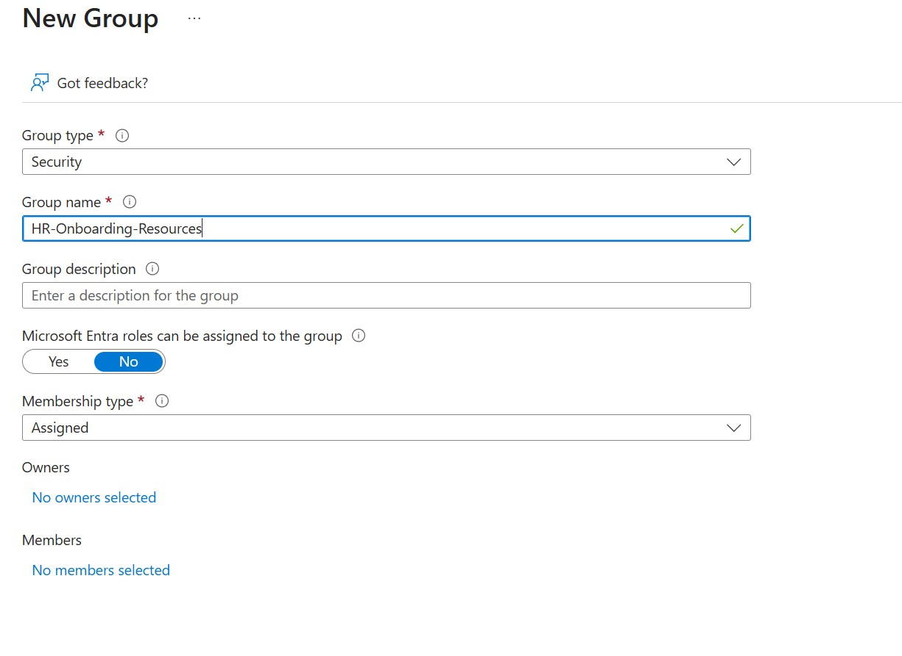
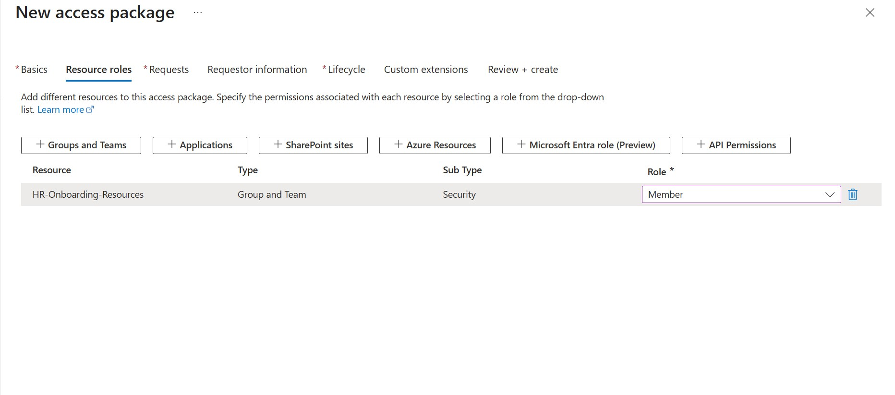
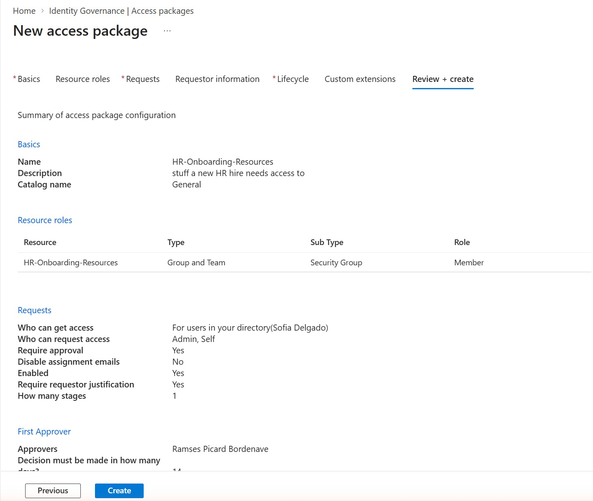
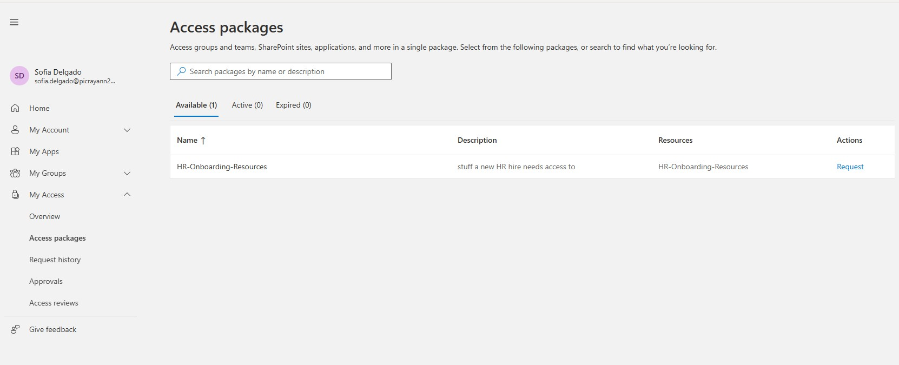
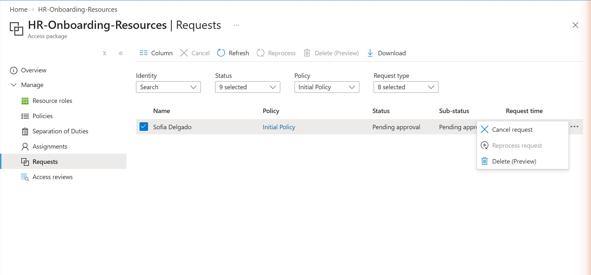
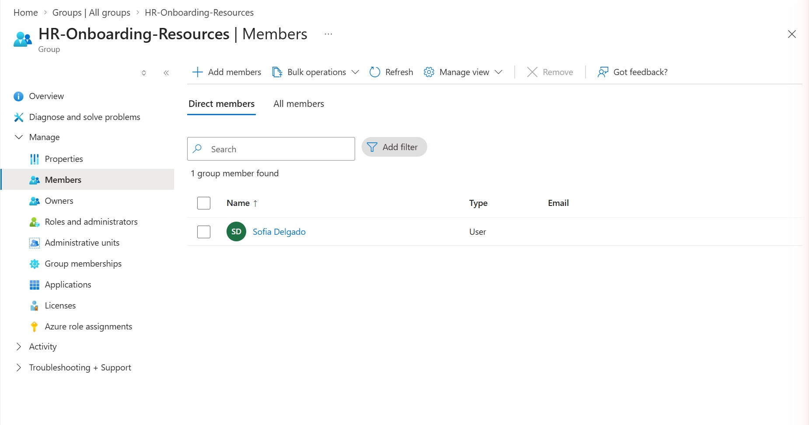

# Priority 1 — Access Package with a Policy

**Project:** Zero Trust Access Governance Lab
**Domain:** Implement identity governance (Entitlement Management — access packages and policies)
**Status:** Configured in a live Microsoft Entra tenant; end-to-end request → approval → delivered assignment verified

## Objective

Use Entitlement Management to package a resource behind a formal, self-service request process — instead of an admin manually adding users to a group. Here, an access package named **HR-Onboarding-Resources** was created in the General catalog, tied to a stand-in security group of the same name, with an initial policy controlling who can request it, what's required for approval, and when access expires. This is the final milestone of Priority 1 of the Zero Trust Access Governance Lab.

## Environment

| Item | Value |
|---|---|
| Tenant | picrayann29.onmicrosoft.com |
| Feature | Identity Governance > Entitlement Management > Access Packages |
| Access package | HR-Onboarding-Resources (General catalog) |
| Resource role | HR-Onboarding-Resources group (Security), Role = Member |
| Policy | Initial Policy |
| Who can request | Sofia Delgado (For users in your directory) — Admin, Self |
| Require approval | Yes — First approver: Ramses Picard Bordenave |
| Require requestor justification | Yes |
| Expiration | Assignments expire after 90 days |
| Require access reviews | No (not enabled on this policy) |

## Steps Performed

1. Created a Security group, HR-Onboarding-Resources, as an empty stand-in resource representing the set of things a new HR hire needs access to.
2. In Identity Governance > Entitlement Management > Access Packages, created a new access package in the General catalog and added HR-Onboarding-Resources as a resource role with Role = Member.
3. Configured the initial policy: requests scoped to Sofia Delgado, approval required (Ramses Picard Bordenave as first approver), requestor justification required, and assignments set to expire after 90 days.
4. Created the package and confirmed the configuration on the Review + create summary.
5. Signed in as Sofia Delgado, went to My Access > Access packages, and submitted a request for HR-Onboarding-Resources.
6. Confirmed the request moved through the approval workflow to a **Delivered** status, which provisioned Sofia into the HR-Onboarding-Resources group.
7. Verified from the admin side (Assignments blade) that Sofia's assignment carries an end date of 2026-10-30 — 90 days after the policy's creation date — confirming the expiration policy is actually enforced, not just configured.

## Screenshots

### 1. Creating the stand-in resource group

### 2. Selecting the resource role for the access package

### 3. Access package policy summary (Review + create)

### 4. Sofia Delgado's MyAccess — package available to request

### 5. Sofia's request — pending approval

### 6. Final assignment — Sofia added to the group

## Validation

- Naming note: the package name used throughout this write-up (HR-Onboarding-Resources) is the name actually live in the tenant, confirmed via the Access Packages list, the Review + create summary, Sofia's MyAccess view, and the Requests/Assignments blades. An earlier "AP001-HR-Onboarding" naming attempt was not the package that was actually created and is not referenced here.
- Policy note: "Require access reviews" is set to **No** on the Initial Policy — access reviews are not wired into this package's lifecycle. Approval, justification, and 90-day expiration are all confirmed active.
- Confirmed via the Requests blade (read-only, admin side) that Sofia Delgado's request status is **Delivered**, meaning it was fully approved and provisioned — a step further along than the "pending approval" state captured in one of the screenshots above.
- Confirmed via the Assignments blade (read-only, admin side) that Sofia's assignment shows an end date of **2026-10-30**, exactly 90 days after the policy's creation date of 2026-08-01, proving the expiration setting is enforced rather than merely configured.

## Key Takeaways

- Access packages formalize "how access is granted," complementing access reviews, which formalize "whether access should continue." Milestone 7's access review re-certifies existing group membership on a schedule; this milestone controls the front door — how someone gets into that membership in the first place, with approval and justification baked in.
- Requiring approval and justification turns a self-service request into an auditable transaction. Instead of a user simply being added to a group, there's a recorded requestor, a recorded approver, a justification, and a decision — every step of which is visible in the Requests blade.
- Expiration prevents access packages from becoming another source of stale access. A 90-day expiration means Sofia's access will lapse automatically unless it's extended or re-requested, avoiding the same "permanent membership" problem access reviews exist to catch.
- Not every access package needs an access review layered on top. Leaving "Require access reviews" off here was a deliberate simplification for this lab policy — in a production environment, combining an expiring access package with a periodic access review would give both automatic expiration and human re-certification as overlapping controls.
- This closes out Priority 1. Across eight milestones, this project has covered Conditional Access (MFA, named locations, session controls, What-If), Privileged Identity Management (role settings, eligibility, activation), Access Reviews, and now Entitlement Management — the full identity governance foundation the SC-300 exam weights most heavily.

*Configuration performed in a personal, non-production tenant as part of SC-300 exam preparation.*

